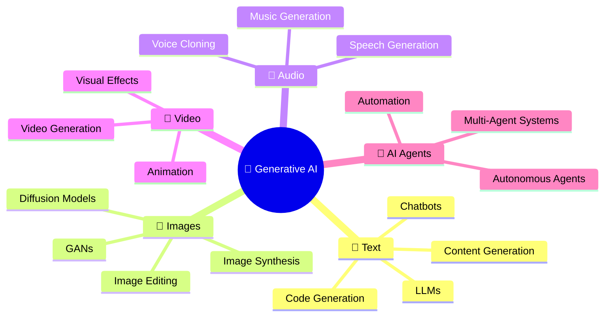
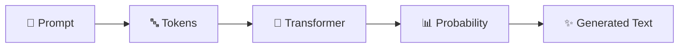
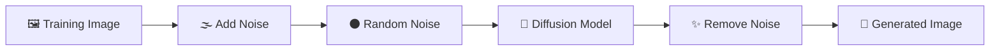
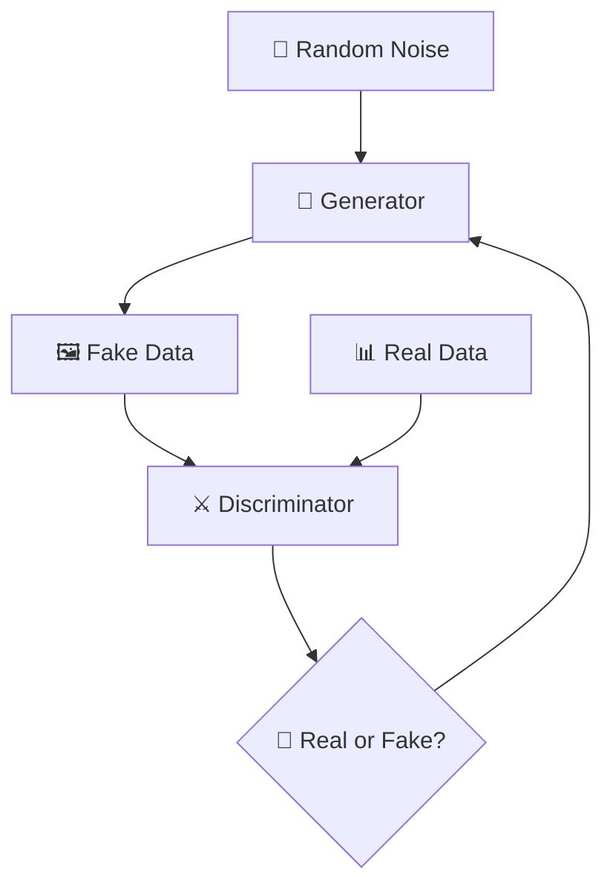
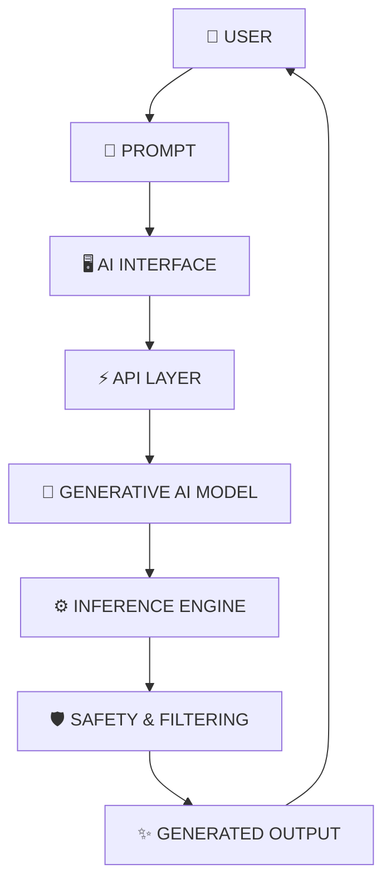
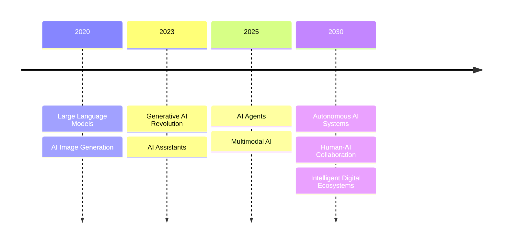
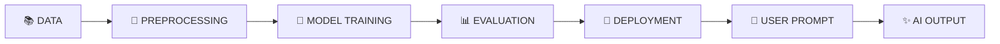

<div align="center">

<!-- HERO TITLE -->

# ✨ 𝐆𝐄𝐍𝐄𝐑𝐀𝐓𝐈𝐕𝐄 𝐀𝐈

### *Create • Imagine • Generate • Innovate*


<br/>


</div>

---

<div align="center">

## 🌌 The New Era of Artificial Intelligence


</div>

<br/>

> **Generative AI is a revolutionary branch of Artificial Intelligence that can create entirely new content — from human-like text and realistic images to music, videos, software code, and more.**

---

# 🚀 What is Generative AI?

Generative AI learns patterns, relationships, and structures from massive amounts of data.

Instead of simply **classifying or predicting**, Generative AI can create something new.

<div align="center">

```text id="zvtqnc"
Traditional AI

INPUT
  │
  ▼
🤖 AI MODEL
  │
  ▼
📊 PREDICTION
```

### 🔥 VS

```text id="jytm9h"
Generative AI

PROMPT / IDEA
      │
      ▼
┌───────────────────┐
│  🧠 AI MODEL      │
│                   │
│ Learns Patterns   │
│ Understands Data  │
└─────────┬─────────┘
          │
          ▼
     ✨ CREATION

Text • Image • Audio • Video • Code
```

</div>

---

# 🧠 The Generative AI Ecosystem

<div align="center">



</div>

---

# ⚙️ How Generative AI Works

<div align="center">


</div>

### 🔄 Simple Explanation

| Step                  | Process                                                          |
| --------------------- | ---------------------------------------------------------------- |
| **1️⃣ Prompt**        | User gives an instruction                                        |
| **2️⃣ Processing**    | AI converts information into mathematical representations        |
| **3️⃣ Understanding** | Neural networks identify relationships and patterns              |
| **4️⃣ Prediction**    | The model predicts the next token, pixel, sound, or data element |
| **5️⃣ Generation**    | The final AI-generated output is created                         |

---

# 🌟 What Can Generative AI Create?

<div align="center">

<table>
<tr>

<td align="center" width="33%">

## 💬

### 𝐓𝐄𝐗𝐓

Chatbots
Articles
Stories
Translation
Summaries

</td>

<td align="center" width="33%">

## 🎨

### 𝐈𝐌𝐀𝐆𝐄𝐒

Digital Art
Photography
Designs
Illustrations
Concept Art

</td>

<td align="center" width="33%">

## 🎵

### 𝐀𝐔𝐃𝐈𝐎

Music
Speech
Voice
Sound Effects

</td>

</tr>

<tr>

<td align="center">

## 🎥

### 𝐕𝐈𝐃𝐄𝐎

Animations
AI Films
Visual Content

</td>

<td align="center">

## 💻

### 𝐂𝐎𝐃𝐄

Applications
Functions
Websites
Debugging

</td>

<td align="center">

## 📊

### 𝐃𝐀𝐓𝐀

Synthetic Data
Simulations
Predictions

</td>

</tr>
</table>

</div>

---

# 🧠 Core Generative AI Models

## 01. 💬 Large Language Models

<div align="center">


</div>

LLMs are designed to understand and generate human-like language.

### Core Process



### Applications

`Chatbots` • `Code Generation` • `Translation` • `Writing` • `Summarization`

---

# 02. 🎨 Diffusion Models

<div align="center">


</div>

Diffusion models create images by learning how to **remove noise step by step**.



---

# 03. ⚔️ Generative Adversarial Networks

GANs use two competing neural networks.

<div align="center">



</div>

### Components

| Model                | Role                               |
| -------------------- | ---------------------------------- |
| 🎨 **Generator**     | Creates new data                   |
| 🔍 **Discriminator** | Detects real or generated data     |
| 🔄 **Training**      | Both networks continuously improve |

---

# 🧬 Generative AI Architecture

<div align="center">



</div>

---

# 🔥 Generative AI Applications

<div align="center">


</div>

| Industry                 | AI Applications                                    |
| ------------------------ | -------------------------------------------------- |
| 🏥 **Healthcare**        | Drug discovery, medical assistants, synthetic data |
| 🎓 **Education**         | AI tutors, personalized learning                   |
| 💻 **Software**          | Code generation, debugging, automation             |
| 🎨 **Creative Industry** | Art, music, video, design                          |
| 🏢 **Business**          | Customer support, content generation               |
| 🔬 **Research**          | Simulations and scientific discovery               |

---

# 🔮 The Future of Generative AI



### 🚀 Future Technologies

* 🤖 Autonomous AI Agents
* 🧠 Artificial General Intelligence
* 🌐 Multi-Agent Systems
* 🎙️ Real-Time AI Assistants
* 🧬 AI for Scientific Discovery
* 🏙️ Intelligent Digital Ecosystems

---

# 🛡️ Responsible AI

Generative AI must be developed responsibly.

```text id="njhkeg"
           🧠 RESPONSIBLE AI
                  │
        ┌─────────┼─────────┐
        │         │         │
        ▼         ▼         ▼
      🔒         ⚖️        🛡️
    Privacy     Fairness   Security
        │         │         │
        └─────────┼─────────┘
                  ▼
             🤝 TRUST
```

### Important Principles

* 🔒 Privacy Protection
* ⚖️ Fairness and Bias Reduction
* 🛡️ AI Security
* 📜 Copyright Awareness
* 🔍 Transparency
* 🚫 Misinformation Prevention

---

# 🛠️ Generative AI Technology Stack

<div align="center">

| Layer                | Technologies                               |
| -------------------- | ------------------------------------------ |
| 🧠 **AI Models**     | Transformers, LLMs, GANs, Diffusion Models |
| 🐍 **Programming**   | Python                                     |
| 🔥 **Deep Learning** | PyTorch, TensorFlow                        |
| 🤗 **AI Frameworks** | Hugging Face                               |
| 🌐 **Backend**       | FastAPI, Flask                             |
| 🖥️ **Frontend**     | React, HTML, CSS                           |
| 🗄️ **Database**     | PostgreSQL, MongoDB                        |
| ☁️ **Deployment**    | Docker, Cloud Platforms                    |

</div>

---

# 📈 The Generative AI Workflow

<div align="center">



</div>

---

# 🎯 Key Takeaway

<div align="center">

## ✨ Generative AI is not just about predicting the future.

# **IT IS ABOUT CREATING IT.**

```text id="wcou1p"
       HUMAN IDEA
            │
            ▼
      🧠 GENERATIVE AI
            │
            ▼
    ┌───────┼────────┐
    ▼       ▼        ▼
  💬 TEXT  🎨 IMAGE  💻 CODE
    │       │        │
    └───────┼────────┘
            ▼
       🚀 INNOVATION
```

</div>

---

<div align="center">

# ⭐ Explore • Learn • Build • Create

### **𝐆𝐞𝐧𝐞𝐫𝐚𝐭𝐢𝐯𝐞 𝐀𝐈 is transforming imagination into reality.**


<br/><br/>

### 👨‍💻 Created by **Subhasish Sahoo**

**B.Tech — Computer Science, Artificial Intelligence & Machine Learning**

<br/>

⭐ **If you like this repository, don't forget to star it!**

</div>
